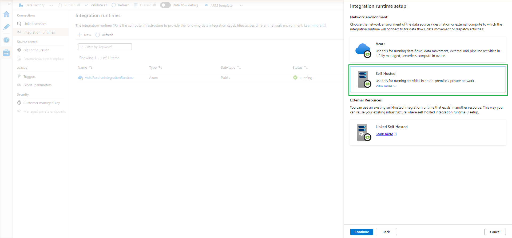
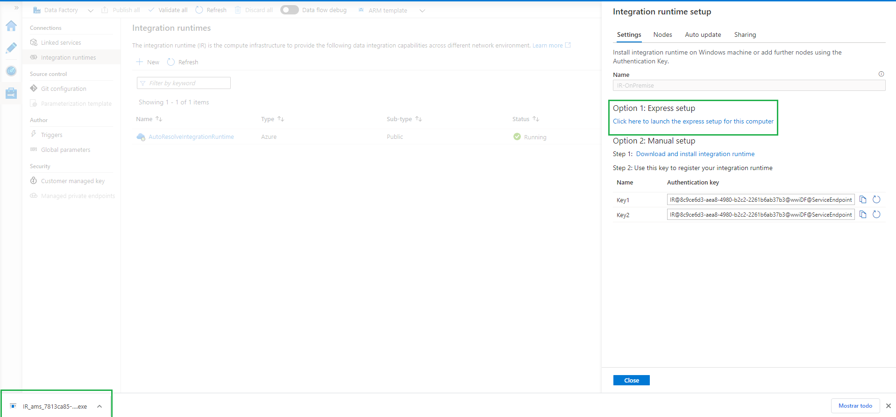
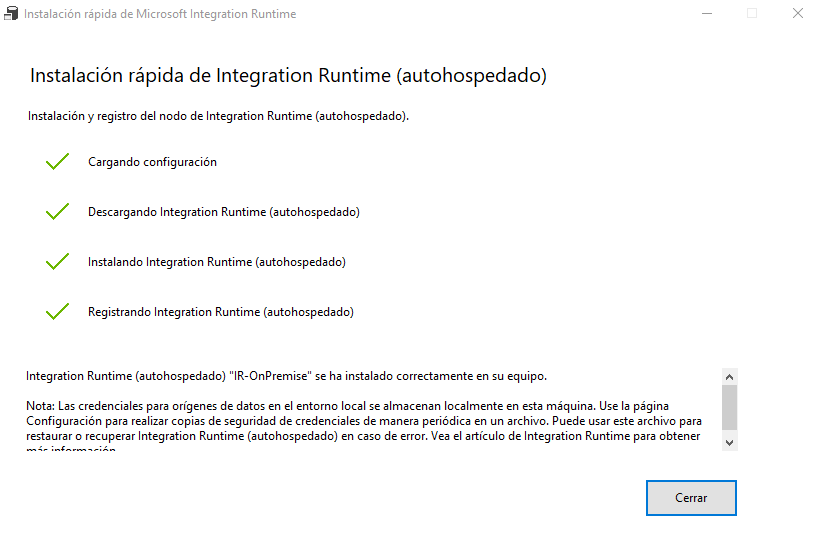
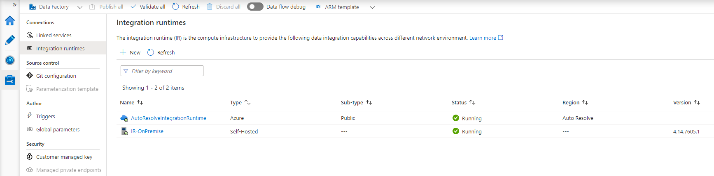

# Creación de Data Factory y Configuración de Integration Runtime

1. Crear el servicio Data Factory (_Create a resourse -> Data Factory_)
    1. Basics
        1. Region: _(US) East US 2_
        2. Name: _wwiDF_
        3. Version: _V2_
		
		 
    
	2. Git Configuration
        1. Habilitar _Configure Git later_
		
		 
		
		 
        
2. Ahora vamos a crear y configurar un Integration Runtime 
    1. Ir a la interfaz de Data Factory (_Data Factory -> Author & Monitor_)
	
	 
	
    2. En la sección _Manage -> Integration Runtime_ crear un nuevo _Azure, Self-Hosted_
	
		 
		
    3. Seleccionar _Self-Hosted_
	
		 
		
    4. Asignarle un nombre (por ejemplo _IR-OnPremise_) y crearlo
	
		 
		
    5. Descargar el agente de Integration Runtime, opción 1 **Express setup**
	
		 
		
	6. Instalar y validar el agente de IR
	
		 
		
		 
		
		 