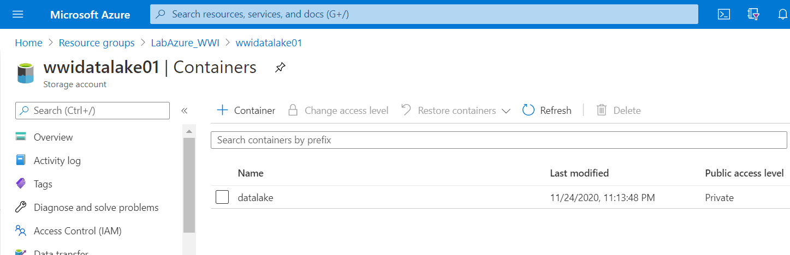

# Creación de Data Lake

1. Creación de Data Lake (_Create a resourse -> Storage account_)
    1. Basics
        1. Storage account name: _wwidatalakeXX_ (donde XX se reemplaza por un numero)
        2. Location: _(US) East US 2_
        3. Performance: _Standard_
        4. Account kind: _StorageV2_
        5. Replication: _LRS_
     2. Advanced
        1. Data Lake Storage Gen2: _Enabled_
	
	 
	
	 
	
	 
	
2. Crear un contenedor; por ejemplo **_datalake_**

	 
	
	 

3. Dentro del contenedor vamos a crear 2 directorios
		1. _ventas_
		2. _staging_
	
	 
	
	 
	
4. Descargar los archivos **[ventas.zip](./files/ventas.zip)** y **[staging.zip](./files.staging.zip)** y subir sus contenidos a los 2 directoriso previamente creados

	 
	
	 

5. Descargar el archivo **[inputs.zip](./files/inputs.zip)** y subir el contenido, excepto el archivo **_city.csv_**, al contenedor **_datalake_**

	 