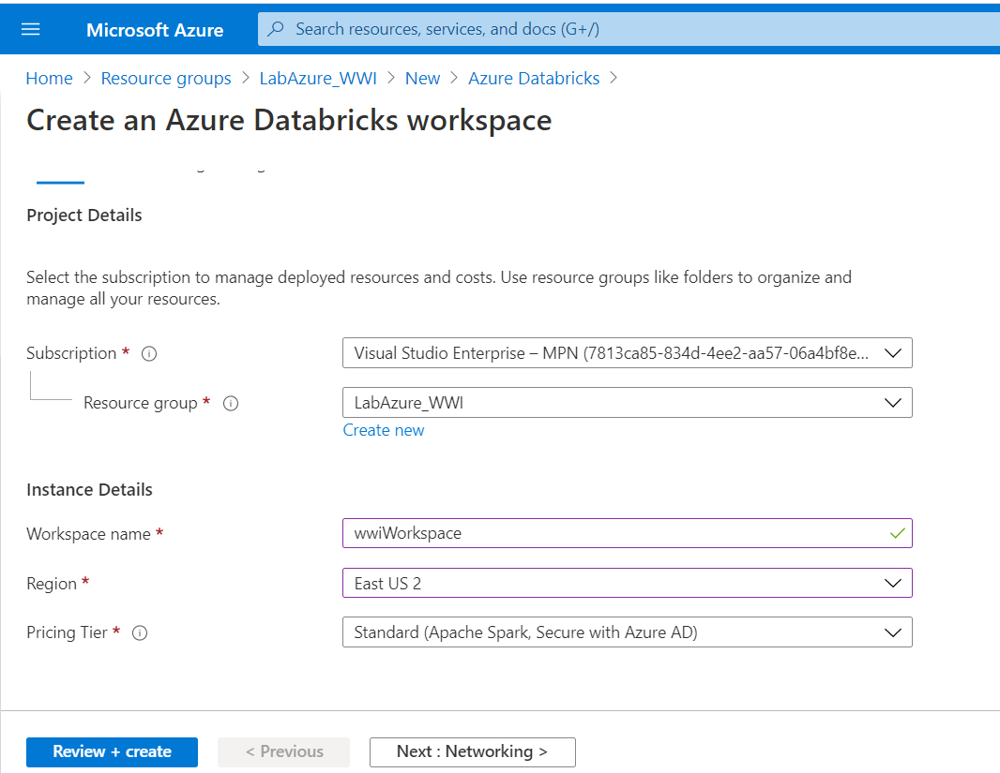
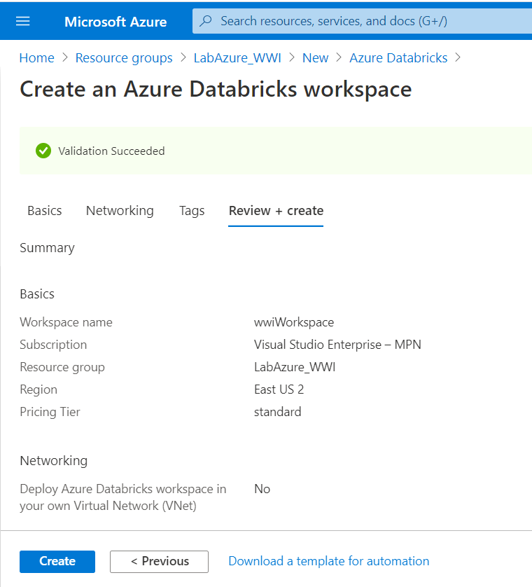
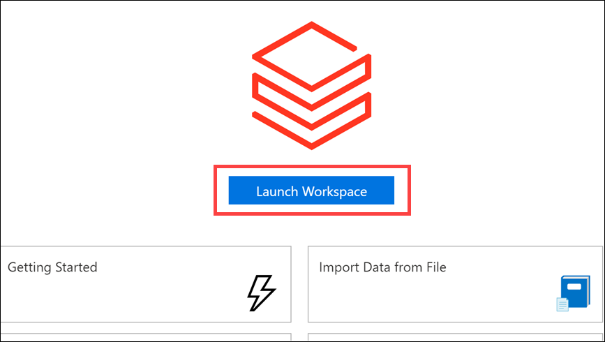
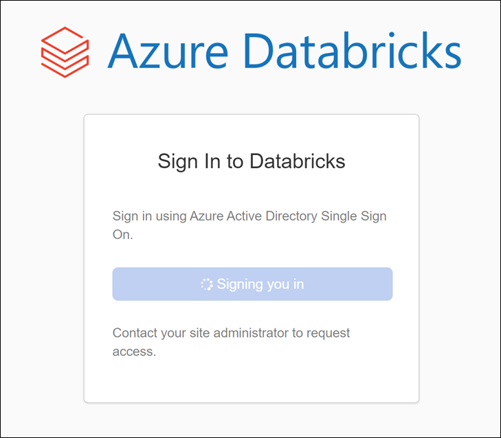
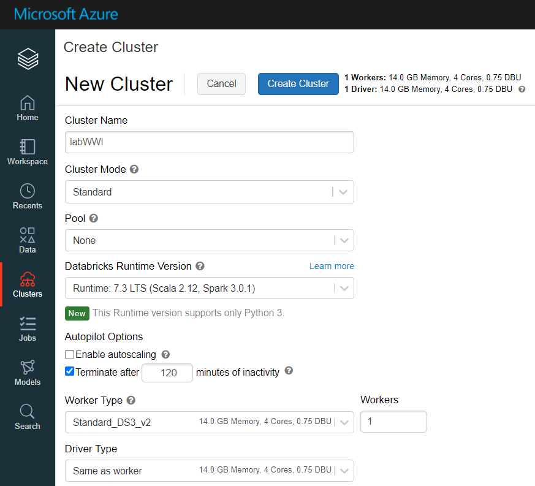
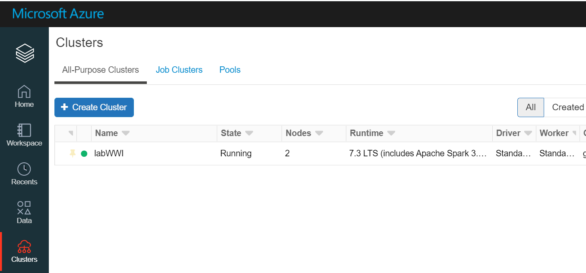

# Creación de Databricks

1. Crear el servicio Databricks (_Create a resourse -> Azure Databricks_)
	1. Workspace name: _wwiWorkspace_
	2. Region: _(US) East US 2_
	3. Pricing Tier: _Standard_

	 
	
	 
	
2. Crear y configurar Cluster
	1. Desde el portal ingresar al workspace
	
	 
	
	 

3. Ir a la sección **Clusters** y crear uno nuevo

	 
	
	1. Cluster Name: _labWWI_
	2. Cluster Mode: _Standard_
	3. Pool: _None_
	4. Databricks Runtime Version: _Runtime: 7.3 LTS (Scala 2.12, Spark 3.0.1)_
	5. Enable Autoscaling: _destildar la opción_
	6. Terminate after: _habilitar opción y dejar 120_
	7. Worker Type: _Standard_DS3_v2_
	8. Worker: _1_
	9. Driver Type: _Same as worker_
	10. Seleccionar _Create Cluster_

	 
	
	 