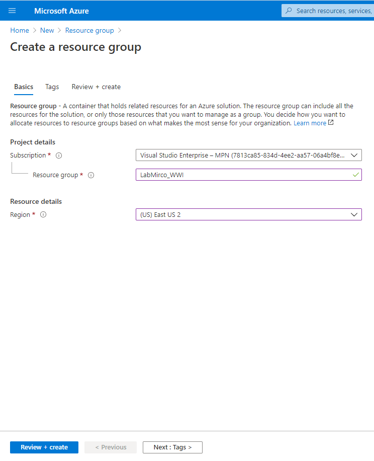

# Creación de Grupo de Recurso

1. Crear un nuevo grupo de recursos (_Create a resourse -> Resource Group_)
    1. Resource group: _LabAzure_WWI_
    2. Region: _(US) East US 2_
        
     

**A partir de ahora todos los servicios que se den de alta se deben asignar al grupo de recurso creado**