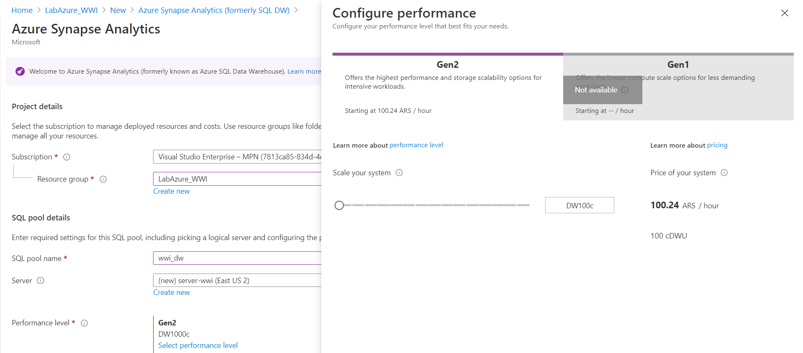

# Creación de Synapse

1. Crear el servicio Databricks (_Create a resourse -> Azure Synapse Analytics (formerly SQL DW)_)
	1. SQL pool name: _wwi_dw_
	2. Server: _Seleccionar **create new**_
		1. Server name: _server-wwi_
		2. Server admin login: _Administrador_
		3. Password: _labWWI_Azure_
		4. Location: _(US) East US 2_
	3. Performace level: _Gen2 DW100c_
	
	 
	
	 