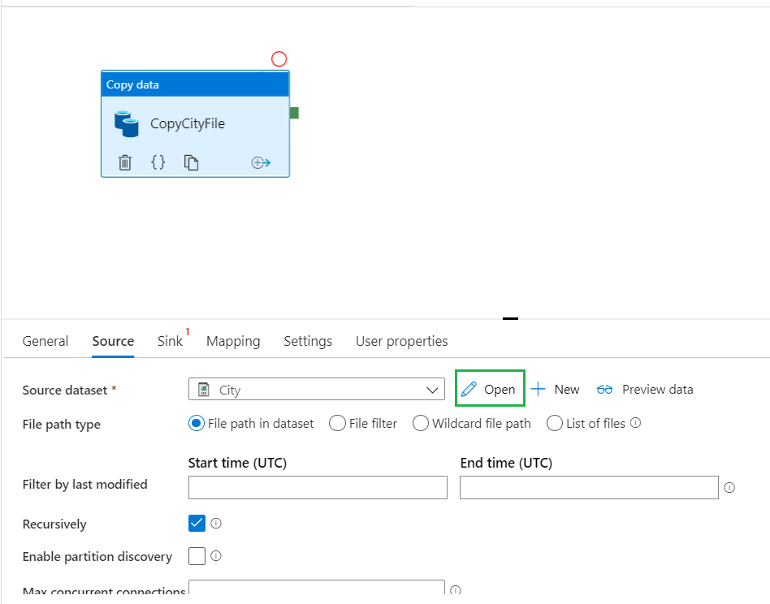

# Ingesta de datos

En esta sección vamos a _mover_ los datos de diferentes origenes al Data Lake. En la primer parte vamos a copiar los datos de nuestro servidor on-premise al Data Lake y luego desde un Storage Account (Azure) al Data Lake 

### On-Premise --> Data Lake
Vamos a utilizar como servidor On Premise nuestra PC/Notebook donde configuramos el Integration Runtime. A continuación se detallan los pasos a realizar:

1. Descargar y descomprimir el archivo [**inputs.zip**](./files/inputs.zip) en el directorio _"C:\Laboratorio\files"_
2. Desde la interfaz de desarrollo de Data Factory nos dirigimos a **Author** y creamos un nuevo Pipeline
	
	 
	        
3. Asignamos un nombre representativo al pipeline; por ejemplo _CopyOnPrem2Azure_City_
	 

4. Dentro de las opciones de Actividades buscamos **_Move & transform --> Copy data_** y lo _arrastramos_ al area de desarrollo. Renombramos la actividad con el nombre _CopyCityFile_.
	
	 
	
    1. Luego debemos configurar el origen (_Source_). Para esto vamos a realizar los siguientes pasos:
		1. Source dataset: Creamos uno nuevo y seleccionamos la opción _File --> File System --> DelimitedText_
	
		 
		
		 
		
		 
		
		2. Ahora debemos asignar un nombre y definir el Linked Service
			1. Name: _City_
			2. Linked service: Creamos uno nuevo (_New_)
	
			 
			
		3. En este paso debemos crear y configurar el Linked Service
			1. Name: _OnPremise_
			2. Connet via integration runtime: _IR-OnPremise_
			3. Host: _C:\Laboratorio\files_
			4. User name: _LabMicro_ (por ejemplo)
			5. Password: Clave del usuario
			6. Validar y crear el Linked Service
		
			 
		
		4. Por último, debemos definir el archivo a leer y sus caractetisticas. Para esto vamos a ir a _Source --> Source dataset --> Open_
		
			 
			
			1. File path: Hacemos click en _Browse_ y seleccionamos el archivo **_city.csv_**
				
				 
				
				 
			
			2. Column delimiter: _Pipe(|)_
			3. First row as header: tildar
			
				 
				
    2. Ahora debemos definir el destino (_Sink_)
		1. Sink dataset: Creamos uno nuevo y seleccionamos la opción _Azure --> Azure Data Lake Storage Gen2 --> Avro_
			
			 
			
			 
		
		2. Ahora debemos asignar un nombre y definir el Linked Service
			1. Name: _AvroCity_
			2. Linked service: Creamos uno nuevo (_New_)
	
				 
				
		3. En este paso debemos crear y configurar el Linked Service
			1. Name: _wwiDataLake_
			2. Connet via integration runtime: _IR-OnPremise_
			3. Authentication method: _Account Key_
			4. Account selection method: _From Azure subscription_
			5. Azure subscription: Seleccionar la subscription de prueba
			6. Storage account name: Seleccionar _wwidatalakeXX_
			7. Validar y crear el Linked Service
			
			 
		
		4. Por último, debemos definir el path y nombre del archivo a generar dentro del Data Lake. Para esto vamos a ir a _Sink --> Sink dataset --> Open_
		
			 
			
			1. File path: Hacemos click en _Browse_ y seleccionamos el contenedor **_datalake_**
			2. En _File path --> File_ escribimos **_city.avro_**
			
				 
			
5. Acabamos de crear nuestro primer pipeline que va a copiar los datos del On-Premise al Data lake. Para guardar nuestro pipeline vamos a publicar haciendo click en _Publish All_

	 

6. Finalizada la publicación vamos a ejecutar el pipeline y verificar que el archivo se haya generado en el Data Lake.
	1. Seleccionar _Add trigger --> Trigger Now_ y luego hacemos click sobre _OK_
		
		 
		
	2. Para monitorear el pipeline nos dirijimos a la seccion Monitor donde podemos ver en detalle el estado del proceso
			
		 
		
		 
		
		 
		
		 
		
### Azure Storage --> Data Lake 
Ahora vamos a realizar los mismos pasos pero en vez de copiar un archivo del On-Premise vamos a conectarnos a un Storage Account (Azure). 

1. Desde la interfaz de desarrollo de Data Factory nos dirigimos a **Author** y creamos un nuevo Pipeline
2. Asignamos un nombre representativo al pipeline; por ejemplo _CopyAzure2Azure_SalesInvoices_
3. Dentro de las opciones de Actividades buscamos **_Move & transform --> Copy data_** y lo _arrastramos_ al area de desarrollo. Renombramos la actividad con el nombre _CopySalesInvoicesFile_.
	1. Luego debemos configurar el origen (_Source_). Para esto vamos a realizar los siguientes pasos:
		1. Source dataset: Creamos uno nuevo y seleccionamos la opción _Azure --> Azure Data Lake Storage Gen2 --> Avro_
	
		 
		
		 
		
		
		2. Ahora debemos asignar un nombre y definir el Linked Service
			1. Name: _AvroSalesInvoices_
			2. Linked service: Creamos uno nuevo (_New_)
	
			 
			
		3. En este paso debemos crear y configurar el Linked Service
			1. Name: _AzureStorage_
			2. Connet via integration runtime: _AutoResolveIntegrationRuntime_
			3. Authentication method: _Account Key_
			4. Account selection method: _Enter manually_
			5. URL: _https://repoventas.dfs.core.windows.net_
			6. Storage account key: _R/Hy9QJp8m/oKajJqgDJ6j+F3hPpolYU1ymtWKXk0ag/1/hjHGMrtjzZSE2FiXycr4X0NyL5sp6PT0VQlL/6nQ==_
			7. Test connection: _To linked service_
			8. Validar y crear el Linked Service
		
			 
		
		4. Por último, debemos definir el archivo a leer.
		
			 
					
    2. Ahora debemos definir el destino (_Sink_) que son los mismos pasos que realizamos en el pipeline anterior
	
		 
		
		 
		
		 

4. Finalizado nuestro segundo pipeline, lo publicamos y ejecutamos

5. Monitoreamos el proceso y validamos en el Data Lake la existencia del archivo