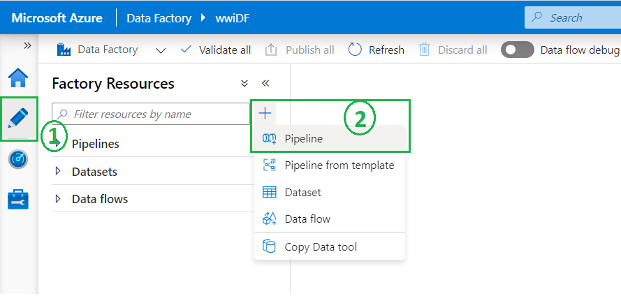
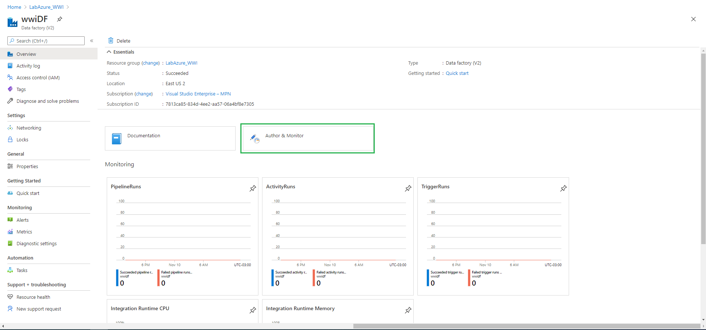

# Ingesta de datos

En esta sección vamos a _mover_ los datos de diferentes origenes al Data Lake. En la primer parte vamos a copiar los datos de nuestro servidor on-premise al Data Lake y luego desde un Storage Account (Azure) al Data Lake 

### On-Premise --> Data Lake
Vamos a utilizar como servidor On Premise nuestra PC/Notebook donde configuramos el Integration Runtime. A continuación se detallan los pasos a realizar:

1. Descargar y descomprimir el archivo **inputs.zip** en el directorio _"C:\Laboratorio\files"_
2. Desde la interfaz de desarrollo de Data Factory nos dirigimos a Author y creamos un nuevo Pipeline
	
	 
	        
3. Asignamos un nombre representativo al pipeline; por ejemplo _CopyOnPrem2Azure_City_
	 

4. Dentro de las opciones de Actividades buscamos **Move & transform --> Copy data** y lo _arrastramos_ al area de desarrollo 
	
	 
	
    1. L
	
		 
		
    3. Seleccionar _Self-Hosted_
	
		 
		
    4. Asignarle un nombre (por ejemplo _IR-OnPremise_) y crearlo
	
		 
		
    5. Descargar el agente de Integration Runtime, opción 1 **Express setup**
	
		 
		
	6. Instalar y validar el agente de IR
	
		 
		
		 
		
		 