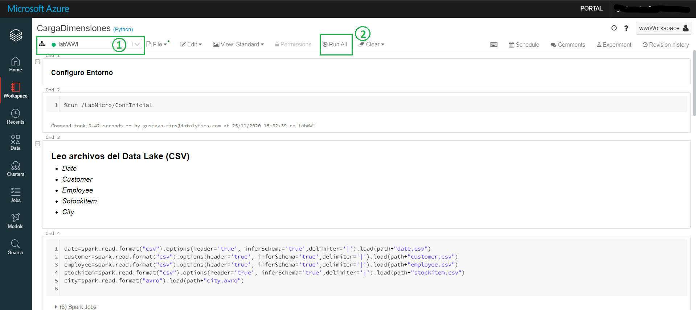
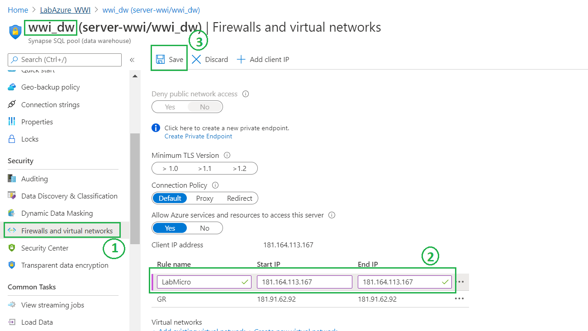
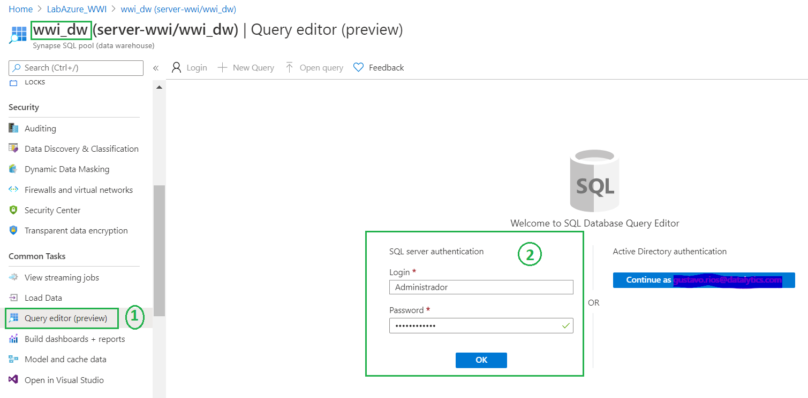
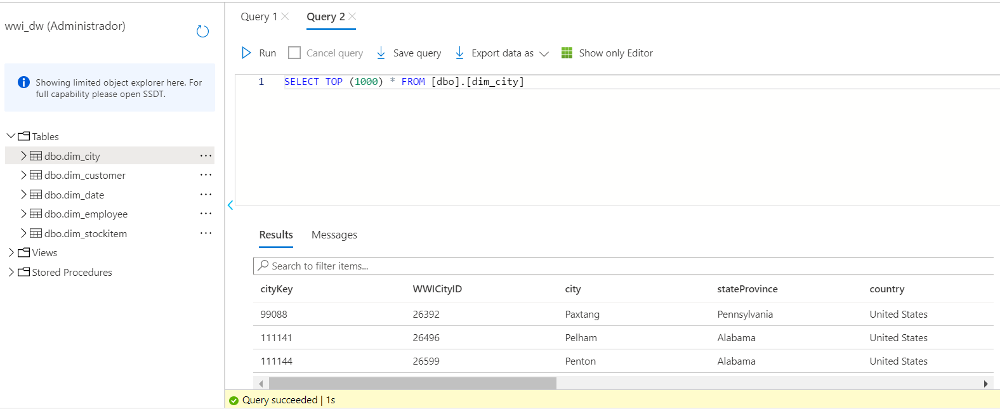

# Integración de datos

En esta seccion vamos a configurar y ejecutar un conjunto de notebooks que nos permitirar cargar datos en tablas de nuestro Data Warehouse

1. Descargar el archivo [LabMicro.dbc](./files/LabMicro.dbc) e importarlo dentro del workspace de Databricks

 

2. Abrir la notebook **_ConfInicial_** y realizar las siguientes configuraciones:
	1. En la segunda celda reemplazar
		1. **_<nombreCuenta>_** por el nombre del servicio Data Lake, en nuesto caso _wwidatalake01_
		2. **_<keyDataLake>_** por la key del servicio Data Lake, esto lo encontamos en _wwidatalake01 --> Access Keys_
	2. En la tercer celda reemplazar
		1. **_<nombreContainer>_** por el nombre del contenedor creado en el Data Lake, por ejemplo _datalake_
		2. **_<nombreDataLake>_** por el nombre del datalake, en nuestro caso _wwidatalake01_ 
		3. **_<carpetaVentas>_** por el nombre de la carpeta creada en nuestro Data Lake, por ejemplo _ventas_
		4. **_<carpetaStaging>_** por el nombre de la carpeta creada en nuestro Data Lake, por ejemplo _staging_
	3. Ahora pasamos a configurar Databricks con Azure Synapse (SQl DW). En la sexta celda
		1. **_<connectionString>_** reemplazar por el connectionString de nuestro Azure Synapse; esto lo enconramos en _wwi_dw --> Connection strings_
		2. Reemplazar **{your_password}** por la clave de conexion a la base de datos
3. Una vez realizado el punto anterior podemos comenzar a poblar nuestro data warehouse y para eso vamos a ejecutar la notebook _CargaDimensiones_
	1. Atachar el cluster a la notebook antes de ejecutar 
	2. Ejecutar la notebook _Run_ _All_ 
		
		 
		
	3. Validar que las tablas se encuentren con datos
		1. Primero hay que habilitar la IP desde la configuracion del firewall
			
			 
			
		2. Por ultimo, ya podemos consultar las tablas
			
			 
			
			 
			
4. Adicionalmente hay una notebook llamada _CargaHecho_ que la utilizaremos para el próximo paso [Orquestación](./Orquestaci&oacute;n.md)