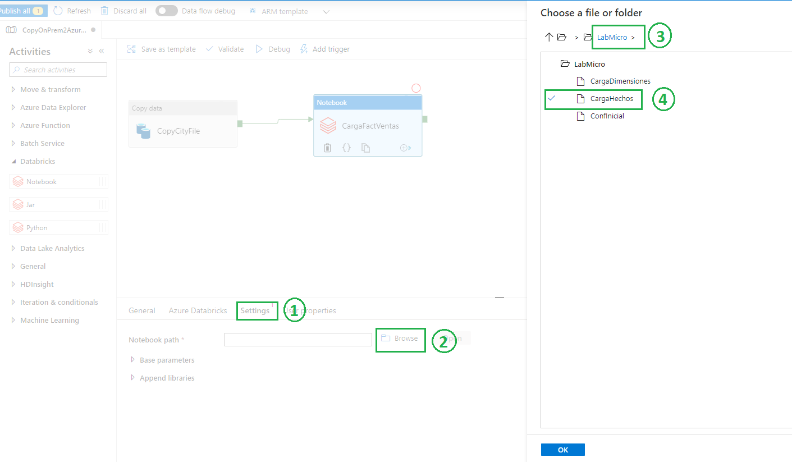

# Orquestación
Ahora que tenemos las tablas dimensionales cargadas vamos a poblar con datos la tabla de hechos. Para realizar esta tarea vamos a crear un 
pipeline (Data Factory) que nos permita tomar _mover_ los datos del On Premise al Data Lake para luego ejecutar una notebook (Databricks) que cargará la tabla de hechos (Azure Synapse).

Todos estos pasos se van a orquestar desde un pipeline de Data Factory; a continuación se listan los pasos:

1. Desde la interfaz de desarrollo de Data Factory nos dirigimos a **Author** y creamos un nuevo Pipeline
	
	 
	        
2. Abrimos el pipeline **_CopyOnPrem2Azure_City_** y agregamos la actividad _Notebook_ y la unimos a la actividad existente
	 

3. A la actividad _Notebook_ le asignamos un nombre representativo, por ejemplo, **_CargaFactVentas_**
	 

4. Debemos crear un linked service a Databricks; para eso debemos realizar
	1. _Azure Databricks --> Databricks linked service --> New_
		 
	2. Configurar el Linked Service
		1. Name: _AzureDatabricks_
		2. Connect via integration runtime: _AutoResolveIntegrationRuntime_
		3. Account selection method: _From Azure subscription_
		4. Azure subscription: Seleccionar la subscription asignada
		5. Databricks workspace: _wwiWorkspace_ 
		6. Select cluster: _Existing interactive cluster_
		7. Authentication type: _Access Token_
		8. Access token: Ir a la seccion [Crear Token](#Crear-Token)
		9. Existing cluster ID: Seleccionar el cluster disponible
		10. Validar y Crear
		
		 
		
		 

5. Creado y configurado el linked service, debemos invocar a la notebook **_CargaHechos_**
	1. _Settings --> Notebook path_, seleccionamos _Browse_
		
		 
		
		 

6. Publicamos el pipeline y lo ejecutamos
	
	 
	
	 
	
	 	

## Crear Token
1. Desde el workspace ir a _User Settings_
	 

2. Seleccionar _Generate New Token_ y asignarle un nombre. 
**copiar el token generado ya que no se puede recuperar el valor**

	 
	
	 