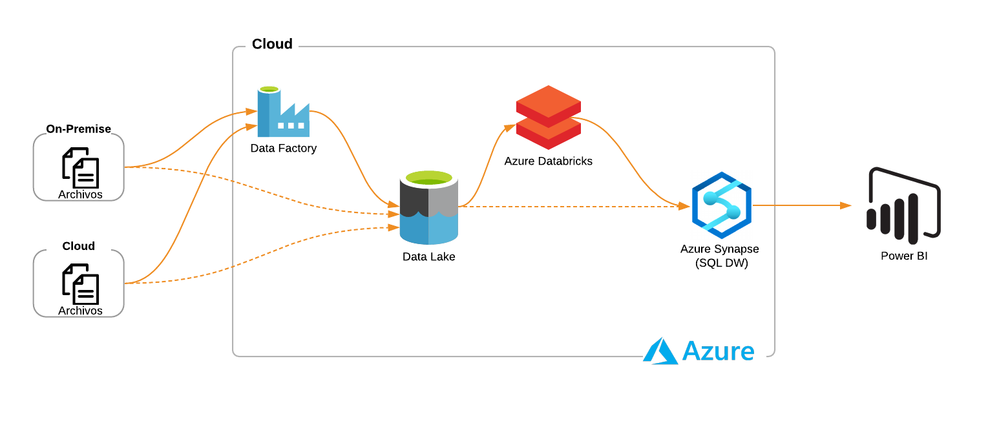

# Laboratorio Microsoft - Arquitecturas Modernas de Datos

## Introducción
Wide World Importers (WWI) es una compañía mayorista que se dedica a la importación y distribución de productos que opera en San Francisco (USA).
Como empresa mayorista, WWI vende a otros mayoristas como clientes minoristas, supermercados, etc.

## Contexto
WWI está diseñando e implementando una prueba de concepto (PoC) de una plataforma de análisis unificada. 
El objetivo es que todas las sucursales y áreas de la compañía trabajen en conjunto en una sola plataforma.
Adicionalmente, se necesita monitorear en tiempo real las unidades que llegan a cada sucursal para saber con cuanto stock de cada línea de producto se cuenta en cada una de ellas.

## Arquitectura de solución propuesta

 

## Laboratorio
A continuación se detallan los pasos a realizar:

0. [Alta de cuenta](./Alta%20de%20Cuenta.md) 
1. [Creación Grupo de Recursos](./Creaci&oacute;n%20de%20Grupo%20de%20Recurso.md) 
2. [Creación Data Lake](./Creaci&oacute;n%20de%20Data%20Lake.md)
3. [Creación Data Factory](./Creaci&oacute;n%20de%20Data%20Factory.md)
4. [Creación de Databricks](./Creaci&oacute;n%20de%20Databricks.md)
5. [Creación de Synapse](./Creaci&oacute;n%20de%20Synapse.md)
6. [Ingesta de datos](./Ingesta%20de%20datos.md)
7. [Integración de datos](./Integraci&oacute;n%20de%20datos.md)
8. [Orquestación](./Orquestaci&oacute;n.md)
9. [Visualización](./Visualizaci&oacute;n.md)
