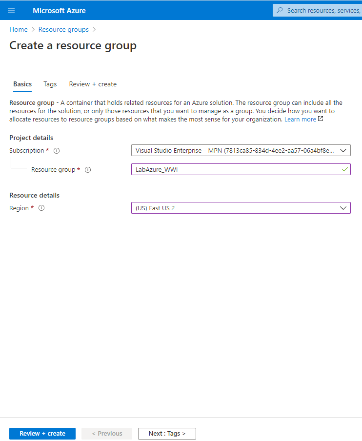

# LabMicro

A continuación se detallan los pasos a realizar:

1. Crear un nuevo grupo de recursos (_Create a resourse -> Resource Group_)
    1. Resource group: _LabAzure_WWI_
    2. Region: _(US) East US 2_
        
     

**A partir de ahora todos los servicios que se den de alta se deben asignar al grupo de recurso creado**

2. Crear el data lake (_Create a resourse -> Storage account_)
    1. Baics
        1. Storage account name: _wwwdatalakeXX_ (donde XX se reemplaza por un numero)
        2. Location: _(US) East US 2_
        3. Performance: _Standard_
        4. Account kind: _StorageV2_
        5. Replication: _LRS_
     2. Advanced
        1. Data Lake Storage Gen2: _Enabled_
        
3. Crear el servicio Data Factory (_Create a resourse -> Data Factory_)
    1. Basics
        1. Region: _(US) East US 2_
        2. Name: _wwwDF_
        3. Version: _V2_
    2. Git Configuration
        1. Habilitar _Configure Git later_
        
4. Ahora vamos a crear y configurar un Integration Runtime 
    1. Ir a la interfaz de Data Factory (_Data Factory -> Author & Monitor_)
    2. En la sección _Manage -> Integration Runtime_ crear un nuevo _Azure, Self-Hosted_
    3. Seleccionar _Self-Hosted_
    4. Asignarle un nombre (por ejemplo _IR-OnPremise_) y crearlo
    5. Descargar el agente de Integration Runtime, opción 1 **Express setup**
