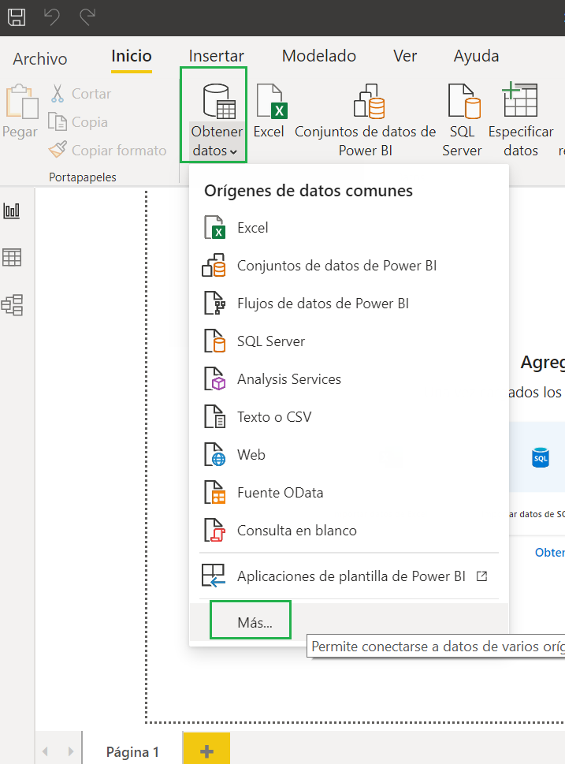
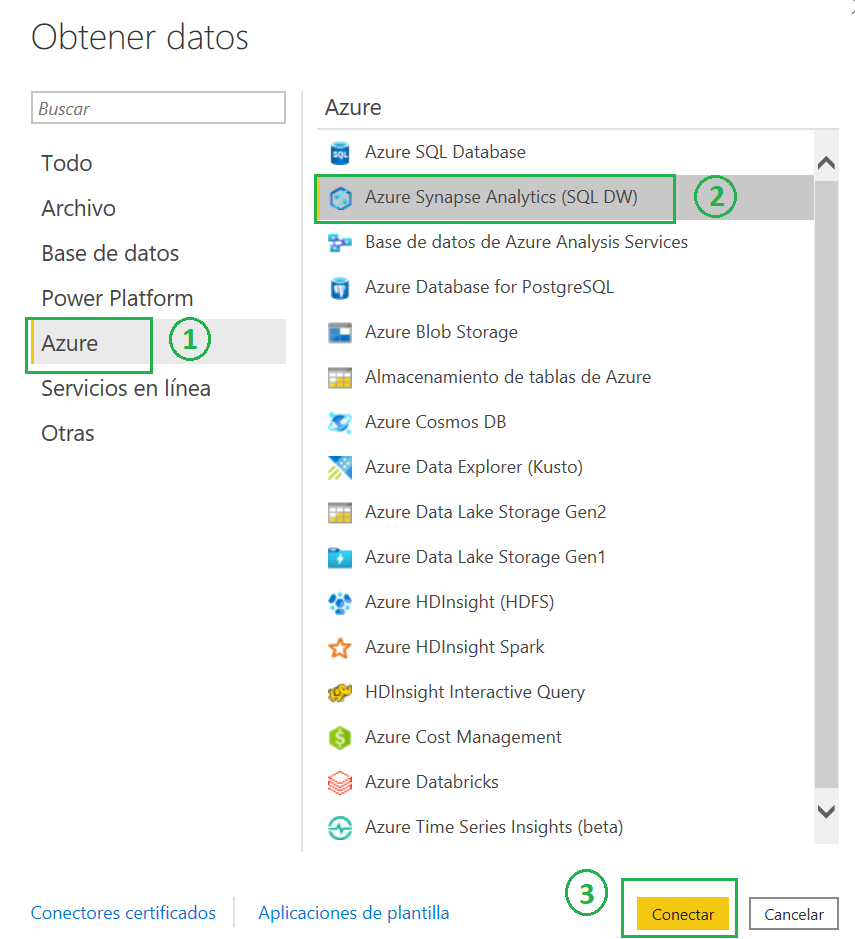
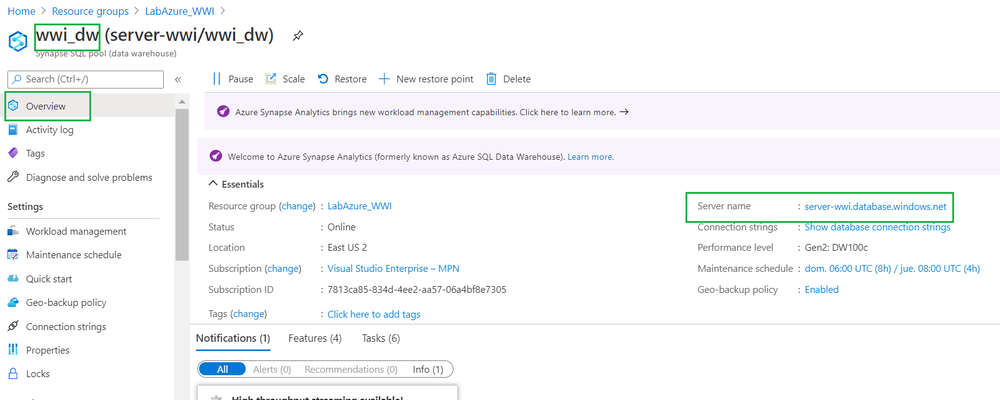
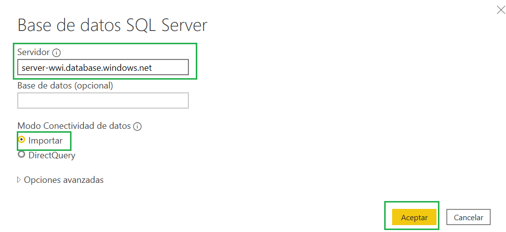
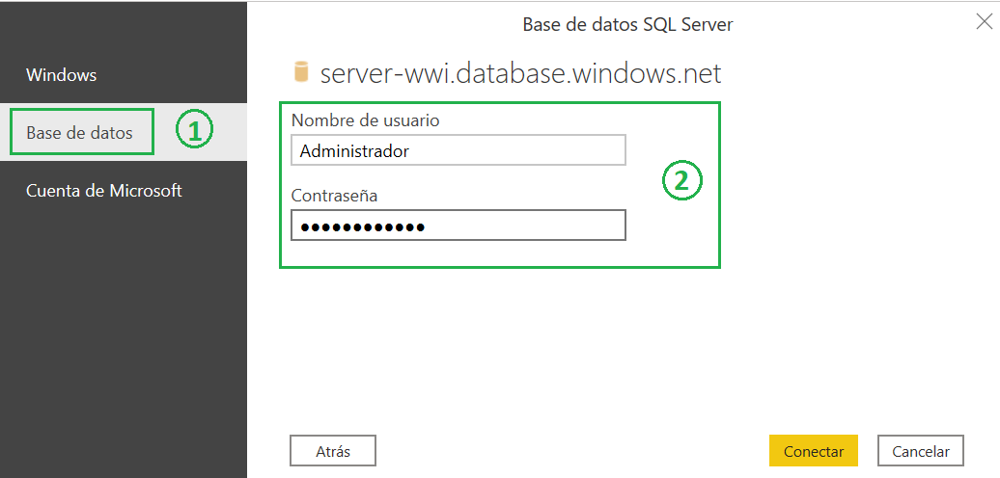
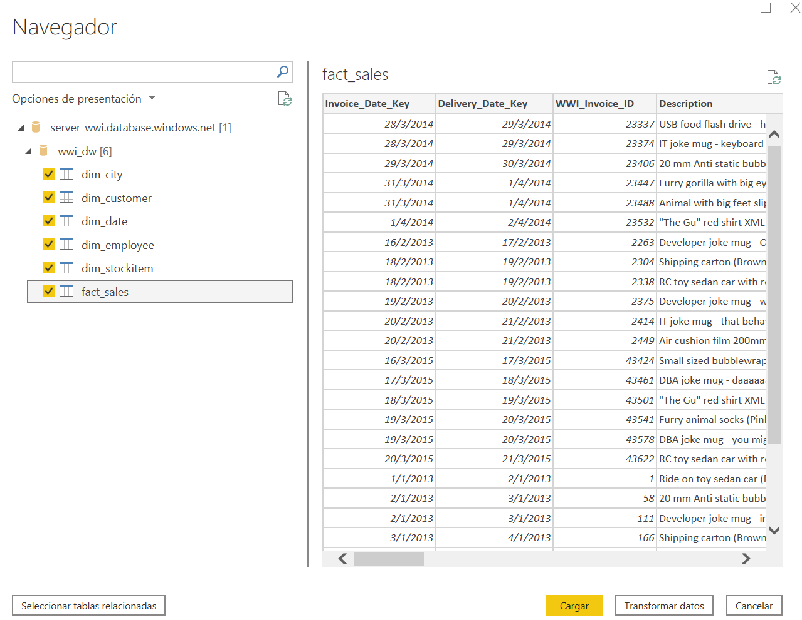
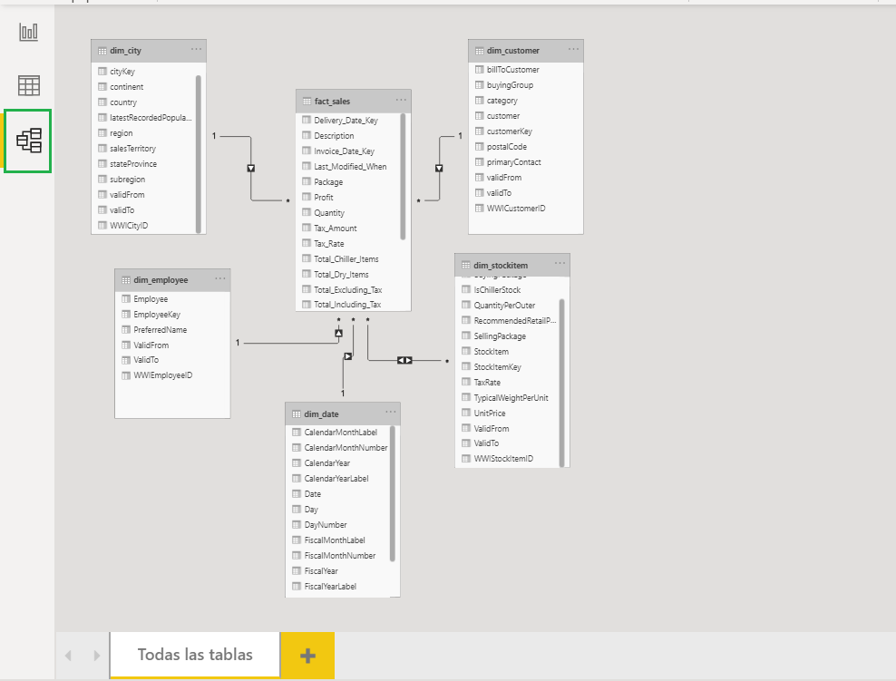
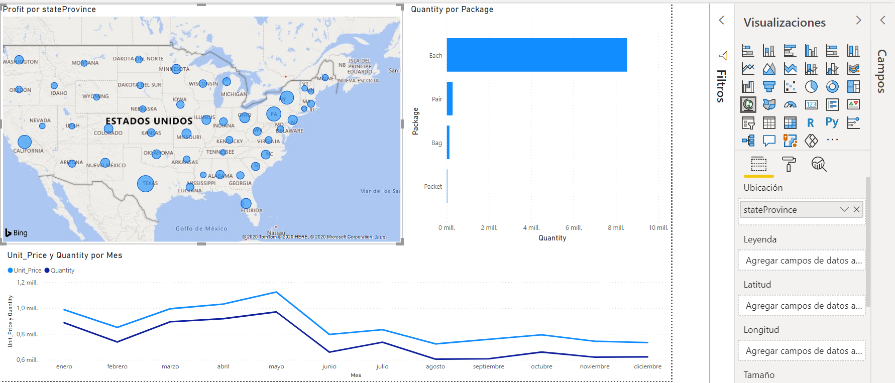

## Visualización
Para finalizar vamos a explotar los datos desarrollando un tablero en Power BI.

1. Descargar e instalar Power BI Desktop desde la [página oficial](https://powerbi.microsoft.com/es-es/desktop/)
2. Abrir Power BI Desktop
3. Configurar el origen

	 
	
	 
	
4. Para obtener el nombre del servidor ir al Servicio de Synapse; _Overview --> Server name_
	 

5. Completar el servidor y _Aceptar_ para luego ingresar usuario y contraseña

	 
	
	 

6.	Seleccionar todas las tablas y _Cargar_

	 

7. Completar las relaciones entre las tablas

	 	
	
8. Crear un tablero; poer ejemplo, se propone
	1. Un mapa que muestre el _Profit_ por _stateProvince_
	2. Un gráfico de barras que muestre _Quantity_ por _Package_
	3. Un gráfico de líneas que muestre _Unit_Price_ y _Quantity_ por _Mes_
		
	 	